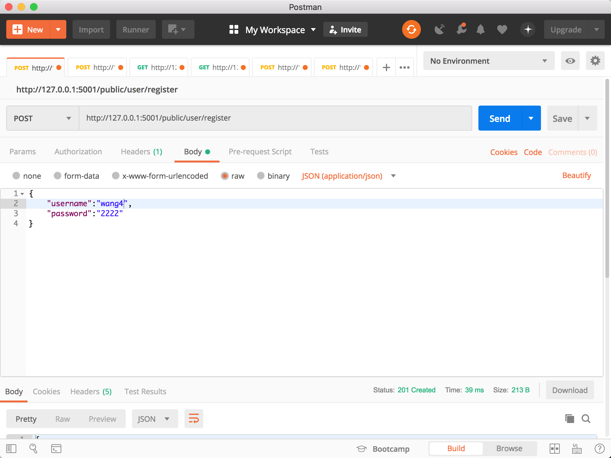
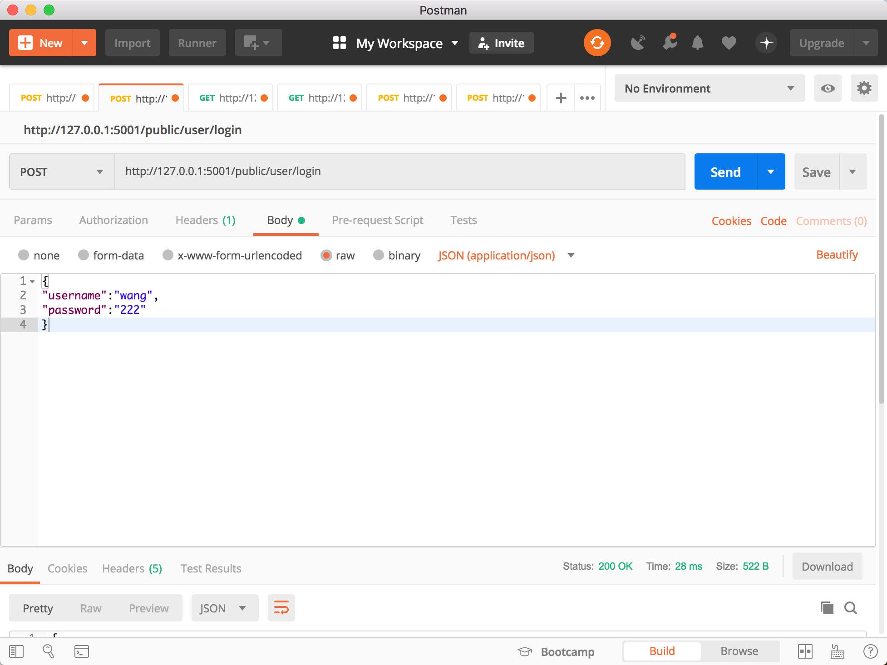
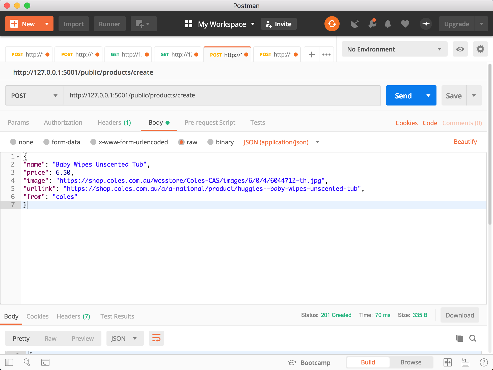
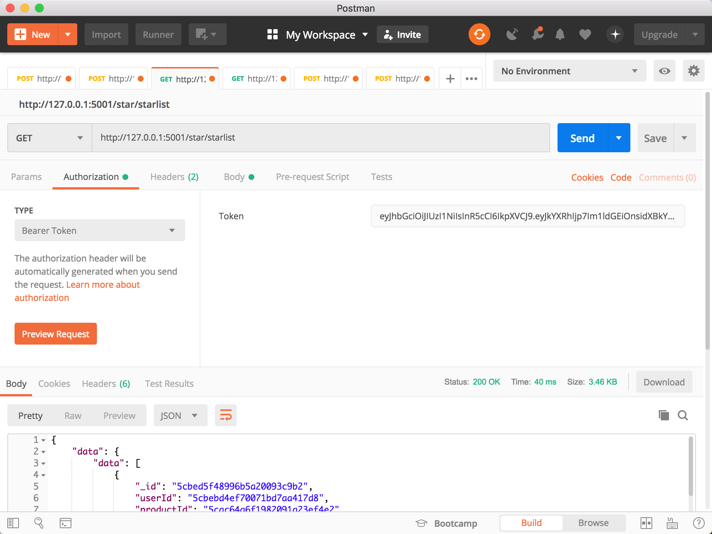

# A boilerplate of shopping nodejs server. 基于nodejs的购物网站后台脚手架。

This is not only a `async-await`-based Koa API project,but also a boilerplate of safe shopping nodejs server, with `koa2`, `koa-jwt`, `mongodb` using `es7`. 

这是一个基于 `async-await`,`koa2`,`koa-jwt`,`mongodb`编写API接口的项目，同时是一个安全的购物网站后台脚手架，支持`es7`。

## 1. Setting up. 项目开始。

Clone this repo and adjust details in `package.json`. Remove the `.git` directory and `git init` to start fresh.

克隆这个仓库，调整适合自己项目的`package.json`，移除`.git`文件并使用`git init`来初始化。

```bash
git clone https://github.com/SoloistWang/Pricer-Server-v2.git
```
## 2. Config package.json. 包配置。
- [`bcrypt`] Hash passwords. 加密密码。
- [`jsonwebtoken`] An implementation of JSON Web Tokens. 实现JSON Web令牌。
- [`koa-jwt`] Authenticate HTTP requests. 验证HTTP请求。
- [`awilix-koa`]  Declarative routing. 声明路由。
- [`babel`] Putting a soft cushion between you all the cool new file formats being developed for node.js such as CoffeeScript, SASS, and Jade. 提供一个环境，任何 JavaScript 代码都可以向下编译成可以在今天随处可用的版本。
- [`jest`] JavaScript Testing. 测试API。
- [`koa-bodyparser`] Parse request bodies. 解析请求主体。
- [`eslint`] Identify and report on patterns found in ECMAScript/JavaScript code. 识别和报告ECMAScript/JavaScript 代码中的模式。
- [`prettier`] Code formatting. 代码格式化。
- [`koa-cors`] Enable cross-domain requests. 配置跨域请求。
- [`nodemon`] Auto-restart when your files change. 文件改动时自动重启进程。
- [`koa-respond`] Add useful methods to the Koa context. 添加有效函数处理koa context。
- [`yenv`] Environment variable management. 全局变量配置。
- [`awilix`] Dependency Injection (DI) container for JavaScript/Node. 创建新的Awilix容器，注入依赖。
- [`fejl`] assertions and errors. 错误处理

run `npm install` to install the dependencies
运行 `npm install` 来加载依赖包

```bash
npm install
```
## 3. Directory structurem. 目录架构。

- `db_init` Init database. 数据库初始化文件。
- `node_modules` Dependency package. 依赖包。
- `src`: App source. 项目源码。
  - `bin`: Executed by `npm run` scripts,for example, starting the server. 脚本，开启服务器。
  - `lib`: App global config ,tools init and looger init. 项目全局配置，工具初始化，log初始化。
  - `middleware`: App middleware. 项目中间件。
  - `models`: database model. 数据库模型。
  - `routes`: API setting. 路由配置文件。
  - `services`: Provide services. 提供服务。
- env.yaml:Define environment variables. 环境变量配置。
  
## 4. Using `npm run` scripts. 使用 `npm run` 运行脚本。

- Start the app in development mode. 测试环境运行项目。
```bash
npm run dev 
```

- Compile the app. Files are emitted to `dist`. 编译项目，文件导出到`dist`文件夹。
```bash
npm run build 
```

- Start the app in production environment. 生产环境运行项目。
```bash
npm run start 
```

- Runs tests. 运行测试脚本。
```bash
npm run test 
```

- Lints + formats the code. 格式化代码。
```bash
npm run lint
```
## 5.Testing API 测试接口
Download the APT testing tools postman first.
<a href="https://www.getpostman.com/products" rel="Postman"></a>

### test user/register api


### test user/login api


### test product/create api


### test product/getlist api
  Don't forget to run the `db_init/dbinit-products.js` or create product first.
  记得运行`db_init/dbinit-products.js`或者先添加一个产品。


### test star/starlist api
  Don't forget to run the `db_init/dbinit-stars.js` or add star first.
  记得先运行`db_init/dbinit-stars.js`或者添加一个产品


### test star/remove api
  Don't forget to run the `db_init/dbinit-stars.js` or add star first.
  记得先运行`db_init/dbinit-stars.js`或者添加一个产品
